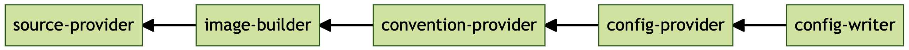

# Cartographer Golden Path: Web

This project provides a [Carvel package](https://carvel.dev/kapp-controller/docs/latest/packaging) with [Cartographer](https://cartographer.sh) supply chains to build golden paths to production for web applications and functions, path from source code to delivery in a Kubernetes cluster.

## Components

* cartographer-golden-path-web

## Description

### Supply Chain: Basic

The `basic` supply chain provides a simple Cartographer path consisting of the following stages:

* Monitor source code repository with FluxCD;
* Transform application source code into OCI images with kpack;
* Apply workload conventions (such as Spring Boot) with Cartographer Conventions;
* Define and configure the workload manifests with Knative and Carvel;
* Push the workload manifests via GitOps or RegistryOps;
* Generate the deliverable resource used for deployment on Kubernetes.

 image builder -> convention-provider -> config-provider -> config-writer" />

### Supply Chain: Testing

Coming soon.

### Supply Chain: Testing and Scanning

Coming soon.

## Prerequisites

* Install the [`kctrl`](https://carvel.dev/kapp-controller/docs/latest/install/#installing-kapp-controller-cli-kctrl) CLI to manage Carvel packages in a convenient way.
* Ensure [kapp-controller](https://carvel.dev/kapp-controller) is deployed in your Kubernetes cluster. You can do that with Carvel
[`kapp`](https://carvel.dev/kapp/docs/latest/install) (recommended choice) or `kubectl`.

```shell
kapp deploy -a kapp-controller -y \
  -f https://github.com/vmware-tanzu/carvel-kapp-controller/releases/latest/download/release.yml
```

## Dependencies

Cartographer Golden Path Web requires the Cartographer Blueprints package to be already installed in the cluster. You can install it from the [Kadras package repository](https://github.com/arktonix/kadras-packages).

## Installation

You can install the Cartographer Golden Path Web package directly or rely on the [Kadras package repository](https://github.com/arktonix/kadras-packages)
(recommended choice).

Follow the [instructions](https://github.com/arktonix/kadras-packages) to add the Kadras package repository to your Kubernetes cluster.

If you don't want to use the Kadras package repository, you can create the necessary `PackageMetadata` and
`Package` resources for the Cartographer Golden Path Web package directly.

```shell
kubectl create namespace carvel-packages
kapp deploy -a cartographer-golden-path-web-package -n carvel-packages -y \
    -f https://github.com/arktonix/cartographer-golden-path-web/releases/latest/download/metadata.yml \
    -f https://github.com/arktonix/cartographer-golden-path-web/releases/latest/download/package.yml
```

Either way, you can then install the Cartographer Golden Path Web package using [`kctrl`](https://carvel.dev/kapp-controller/docs/latest/install/#installing-kapp-controller-cli-kctrl).

```shell
kctrl package install -i cartographer-golden-path-web \
    -p cartographer-golden-path-web.packages.kadras.io \
    -v 0.1.1 \
    -n carvel-packages
```

You can retrieve the list of available versions with the following command.

```shell
kctrl package available list -p cartographer-golden-path-web.packages.kadras.io
```

You can check the list of installed packages and their status as follows.

```shell
kctrl package installed list -n carvel-packages
```

## Configuration

The Cartographer Golden Path Web package has the following configurable properties.

| Config | Default | Description |
|-------|-------------------|-------------|
| `supply_chain` | `basic` | The type of supply chain to use for this golden path. Options: `basic`, `testing`, `testing_scanning`. |
| `service_account` | `default` | The ServiceAccount used by the supply chain. |
| `cluster_builder` | `default` | The ClusterBuilder used by kpack. |
| `git_implementation` | `go-git` | The Git implementation used by Flux. |
| `registry.server` | `""` | The server of the OCI Registry where to store the application images. **Required**. |
| `registry.repository` | `""` | The repository under an OCI Registry where to store the application images. **Required**. |

The GitOps behavior can be configured via the following properties.

| Config | Default | Description |
|-------|-------------------|-------------|
| `gitops.access_secret` | `git-secret` | The Secret containing credentials to access the specified Git repository. |
| `gitops.user_name` | `cartographer` | The name of the user interacting with the Git repository. |
| `gitops.user_email` | `cartographer@kadras.io` | The email of the user interacting with the Git repository. |
| `gitops.commit_message` | `Update from Cartographer` | The commit message to use when pushing configuration changes to Git. |
| `gitops.commit_strategy` | `direct` | Whether to commit configuration changes to Git directly (`direct`) or via a pull request (`pull_request`). |
| `gitops.branch` | `main` | The branch to use for GitOps activities. |
| `gitops.server_address` | `""` | The server hosting the specified Git repository. |
| `gitops.repository_owner` | `""` | The owner of the specified Git repository. |
| `gitops.repository_name` | `""` | The name of the Git repository to use for GitOps. |
| `gitops.pull_request.server_kind` | `""` | The type of Git server where to open the pull request. |
| `gitops.pull_request.commit_branch` | `""` | The branch to use to open a pull request. If empty, a random name is generated. |
| `gitops.pull_request.pull_request_title` | `""` | The title of the pull request. |
| `gitops.pull_request.pull_request_body` | `""` | The body of the pull request. |

You can define your configuration in a `values.yml` file.

```yaml
supply_chain: basic

service_account: default
cluster_builder: default
git_implementation: go-git

registry:
  server: ""
  repository: ""

gitops:
  access_secret: git-secret
  user_name: cartographer
  user_email: cartographer@kadras.io

  commit_message: "Update from Cartographer"
  commit_strategy: direct

  branch: main

  server_address: ""
  repository_owner: ""
  repository_name: ""

  pull_request:
    server_kind: ""
    commit_branch: ""
    pull_request_title: ""
    pull_request_body: ""
```

Then, reference it from the `kctrl` command when installing or upgrading the package.

```shell
kctrl package install -i cartographer-golden-path-web \
    -p cartographer-golden-path-web.packages.kadras.io \
    -v 0.1.1 \
    -n carvel-packages \
    --values-file values.yml
```

## Documentation

For documentation specific to Cartographer, check out [cartographer.sh](https://cartographer.sh).

## References

This package is inspired by:

* the [examples](https://github.com/vmware-tanzu/cartographer/tree/main/examples) in the Cartographer project;
* the [Cartographer Catalog](https://github.com/vmware-tanzu/cartographer-catalog) package used in Tanzu Community Edition;
* the [set of supply chains](https://github.com/vrabbi/tap-oss/tree/main/packages/ootb-supply-chains) included in an example of Tanzu Application Platform OSS stack.

## Supply Chain Security

This project is compliant with level 2 of the [SLSA Framework](https://slsa.dev).


